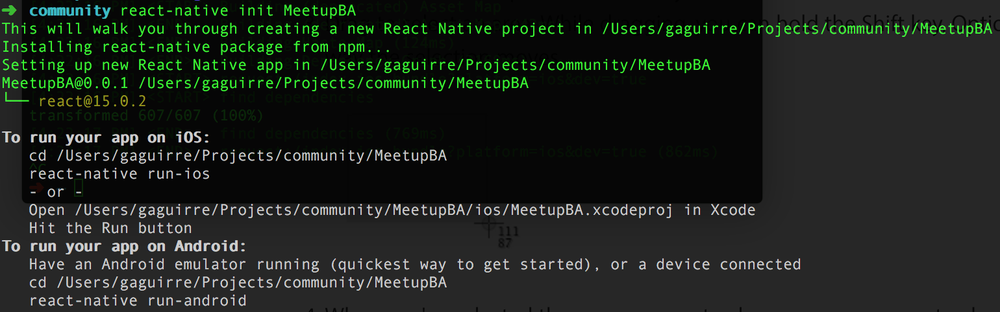

# React Native - Primer proyecto

[React Native](https://facebook.github.io/react-native) es un framework para hacer aplicaciones móviles nativas usando [React](https://facebook.github.io/react)

## Pre-requisitos
Como con React Native se construyen aplicaciones **realmente nativas**, es necesario tener instaladas todas las herramientas y SDKs requeridas por cada entorno que quieras usar, tanto para Android como para iOS.

**No te preocupes!**
React Native tiene una detallada guía paso a paso que es muy útil para empezar.

**_Como consejo, empezá instalando sólo los [Pre-requisitos requeridos](https://facebook.github.io/react-native/docs/getting-started.html#required-prerequisites)_** para tu primer proyecto. Una vez que eso esté funcionando podés seguir con las _**[Instalaciones recomendadas](https://facebook.github.io/react-native/docs/getting-started.html#highly-recommended-installs)**_.

## Demo
### Paso 1 - Iniciando
Asumiendo que ya instalaste todo lo mencionado antes, desde tu terminal corré
```
react-native init MeetupBA
```
Este comando genera la estructura de carpetas del proyecto dentro de la carpeta **MeetupBA** e instala **react** y **react-native** como dependencias del proyecto desde npm.

> **Nota:** dentro del proyecto vas a ver una carpeta para el proyecto de **Android** y otra para el de **iOS**.
Ambos son proyectos **nativos** que podes importar y construir desde el Android Studio y XCode respectivamente.

### Paso 2 - Ejecutando
Una vez que se haya creado correctamente, en tu terminal deberías ver algo parecido a la imagen de abajo. Seguí las instrucciones para correr el proyecto.



Lo que el comando `react-native run-ios` (o `run-android`) hace son tres cosas:
- Lanza en una nueva terminal un **packager** que se va a encargar de _empaquetar_ todos los archivos JS y servir ese _paquete_ a la aplicación
- Construye el proyecto nativo creando una aplicación instalable
- Instala esa app en tu dispositivo/emulador

Tené en cuenta que la primera vez que corras este comando va a llevar mucho más tiempo que las siguientes corridas.


### Paso 3 - Codeando
Ahora que sabemos que el proyecto funciona podemos empezar a codear.

[Habilitá Live Reload](#habilita-live-reload) y editá el archivo `index.ios.js` (o `index.android.js` para Android) para ver como la aplicación se recarga automáticamente.

### Paso 4 - Importando un proyecto que ya existe
Ya sabemos como crear, construir, instalar y editar un proyecto React Native desde cero.
Ahora deberías intentar clonando y corriendo un proyecto existente.

Primero clona este repo que tiene una app de ejemplo
```
git clone git@github.com:ReactJS-BA/meetup-2016-06-08.git MeetupReact
```

Después movete a la carpeta del proyecto e instalá las dependencias del proyecto
```
cd MeetupReact/example
npm install
```

Ahora corré la app
```
react-native run-ios
# or for Android
react-native run-android
```

## Notas
#### Habilita Live Reload
1. Accedé al **_Dev menu_**
  - En iOS presioná **⌘+D**
  - En un dispositivo Android agitalo o presioná el botón de menú
  - En un simulador Android presioná **F2** o **Page Up**
  - En Genymotion presioná **⌘+M**
2. Luego seleccioná la opción **_Enable Live Reload_**

#### En qué se diferencia React Native de React?
React Native **usa** React
- **Uso**: Obviamente, React Native se usa para hacer aplicaciones nativas, no web, y por lo tanto el resultado es una app móvil instalable, no una aplicación web.
- **Rendering**: React Native renderea sus propios componentes en vez de elementos html (`<View>`, `<Text>`, `<Image>` en lugar de `<div>`, `<span>`, ``)
- **Empaquetado**: React Native se encarga de empaquetar el código JS usando su propio [**Packager**](#packager). No hace falta usar ninguna herramienta externa como grunt, gulp, webpack o browserify.
- **Multi platforma**: Gracias al packager, React Native permite tener diferentes archivos para cada plataforma y al mismo tiempo compartir el resto del código. (Más info en [**Packager**](#packager))

#### Packager
React Native tiene un Packager que empaqueta y sirve el código JS dependiendo de las siguientes variables
- `platform`: dependiendo de este parámetro va a empaquetar los archivos **.ios.js** o **.android.js** (junto con los **.js** compartidos)
- `dev`: si es **true** va a mostrar los mensajes de error y advertencia
- `hot`: debe ser **true** para soportar Hot Reloading
- `minify`: si es **true** el código va a ser minificado

Las apps hechas con React Native aprovechan al Packager para brindar funcionalidades como **Live Reload** y **Hot Reloading**.
